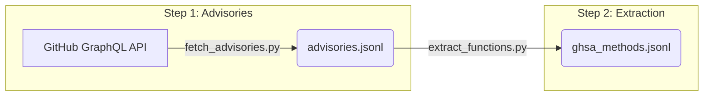

# Data Collection Pipeline

> **Objective:** Fetch security advisories and extract vulnerable Python functions from GitHub (GHSA silver tier data).

This directory contains scripts to crawl the GitHub Advisory Database (GHSA) and extract the exact Python functions modified in fix commits. This forms the "silver" tier of the VulHunter Master Dataset.

## Pipeline Architecture



## Files Description

- **`fetch_advisories.py` (Step 1)**: Queries the GitHub GraphQL API to fetch security advisories for the `PIP` ecosystem. It extracts CVE/GHSA IDs, vulnerability descriptions, CVSS severity, CWE mappings, and most importantly, the URLs to the fix commits.
- **`extract_functions.py` (Step 2)**: Parses the fix commit URLs, uses the GitHub REST API to fetch the raw file contents before and after the commit, and utilizes AST parsing to extract the specific Python functions that were modified. It saves the vulnerable and safe versions of each function as pairs. Note that fine-grained line-level labels are *not* computed here; they are deferred to the preprocessing stage.
- **`run_pipeline.py`**: An end-to-end orchestrator that runs Step 1 and Step 2 sequentially.
- **`utils.py`**: Contains shared utilities such as the `GitHubClient` wrapper (handles authentication and rate limits), source code normalization functions, and AST extraction logic.

## Input / Output

- **Input**: Requires a GitHub Personal Access Token (`GITHUB_TOKEN`) with read access to public repositories.
- **Output**:
  - `data/raw/ghsa/advisories.jsonl`: Raw advisories metadata.
  - `data/raw/ghsa/ghsa_methods.jsonl`: The extracted function pairs (vulnerable/safe) representing the silver-tier dataset.

## How to Run

To run the full end-to-end collection pipeline:

```bash
# Ensure GITHUB_TOKEN is set in your environment or .env file
python scripts/collection/run_pipeline.py
```

To run individual steps with limits for testing:

```bash
# Step 1: Fetch up to 50 advisories
python scripts/collection/fetch_advisories.py --limit 50

# Step 2: Extract up to 100 function pairs
python scripts/collection/extract_functions.py --limit-samples 100
```

> [!WARNING]
> GitHub API rate limits apply. The `GitHubClient` will automatically pause and wait if the rate limit is exceeded, but providing an authenticated token is highly recommended to increase the limit to 5000 requests/hour.
