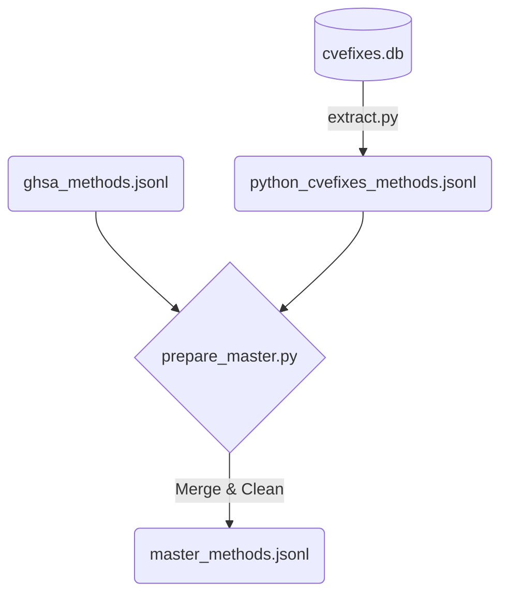

# Data Extraction & Master Dataset Preparation

> **Objective:** Extract gold-tier data from the CVEFixes database and unify it with silver-tier GHSA data to construct the final Master Dataset.

This directory handles the extraction of the gold-tier (CVEFixes) dataset from a local SQLite database and merges it with the silver-tier (GHSA) dataset collected via the `collection` pipeline. It ensures a unified schema for downstream preprocessing.

## Workflow



## Files Description

- **`extract.py`**: Connects to the local `cvefixes.db` SQLite database. It extracts vulnerable and safe versions of Python functions, computing initial line-level labels using `difflib`. This forms the high-quality, human-curated "gold" tier of the dataset.
- **`prepare_master.py`**: The unification script. It takes both the gold dataset (`python_cvefixes_methods.jsonl`) and the silver dataset (`ghsa_methods.jsonl`) and merges them into a single canonical format. Crucially, it performs strict cleansing by discarding noise (e.g., test files, mock objects, setup scripts) and normalizes repository names to ensure accurate repository-disjoint splitting later on.

## Input / Output

- **Inputs**:
  - `data/raw/databases/cvefixes.db`: The downloaded CVEFixes SQLite database.
  - `data/raw/ghsa/ghsa_methods.jsonl`: The output from the collection pipeline.
- **Output**:
  - `data/raw/master_methods.jsonl`: The unified Master Dataset containing both gold and silver samples.

## How to Run

1. First, ensure `cvefixes.db` is present (see `data/raw/databases/README.md` for download instructions).
2. Run the extraction script to generate the gold-tier data:

```bash
python scripts/extraction/extract.py
```

3. Merge gold and silver tiers to create the Master Dataset:

```bash
python scripts/extraction/prepare_master.py
```

> [!IMPORTANT]
> The `prepare_master.py` script applies strict heuristic filters to remove non-production code (like `tests/`, `conftest.py`, `setup.py`). This guarantees the model learns from application logic rather than test scaffolding.
