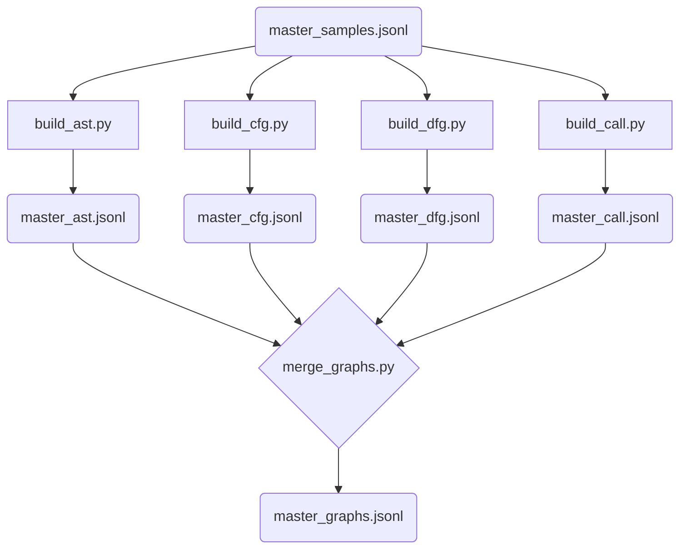

# Program Graph Generation

> **Objective:** Extract structural representations (AST, CFG, DFG, Call Graph) from source code to form heterogeneous graphs.

This directory handles the generation of program graphs necessary for the `graph_only` and `fusion` branches of VulHunter. It parses the Python code using the built-in `ast` module and explicitly extracts syntactic and semantic relationships between program elements (nodes).

## Workflow



## Files Description

- **`build_ast.py`**: Extracts the Abstract Syntax Tree (AST), capturing the hierarchical syntactic structure of the code.
- **`build_cfg.py`**: Extracts the Control Flow Graph (CFG), mapping the execution paths (e.g., branching in `if`/`else` blocks, loops).
- **`build_dfg.py`**: Extracts the Data Flow Graph (DFG), tracking how variables and data states propagate through the code.
- **`build_call.py`**: Extracts the Function Call Graph, capturing interactions between different function calls within the snippet.
- **`merge_graphs.py`**: Combines the four individual graph outputs into a single heterogeneous graph per sample. Note that it concatenates them as a **disjoint union** (adding an ID offset to each subgraph's nodes) rather than aligning/merging identical nodes, relying on the Graph Attention Network (GAT) to process the independent components.

## Input / Output

- **Input**: The cleaned but un-tokenized samples from `data/final/master_samples.jsonl`.
- **Outputs**:
  - Intermediate graphs: `data/processed/master_{ast,cfg,dfg,call}.jsonl`
  - Final merged graph dataset: `data/processed/master_graphs.jsonl`

## How to Run

Generate each graph component, then merge them:

```bash
# 1. Build individual graphs
python scripts/graph/build_ast.py
python scripts/graph/build_cfg.py
python scripts/graph/build_dfg.py
python scripts/graph/build_call.py

# 2. Merge into heterogeneous graphs
python scripts/graph/merge_graphs.py
```

> [!TIP]
> Graph extraction can be CPU-intensive. The scripts process the dataset independently and handle cases where code cannot be parsed perfectly by dropping or falling back gracefully.
