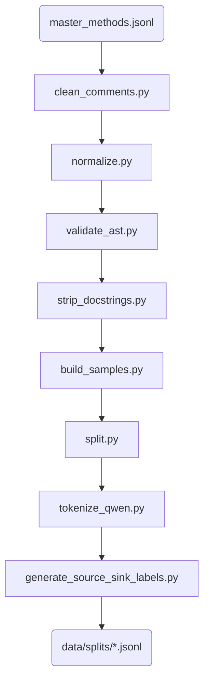

# Data Preprocessing Pipeline

> **Objective:** Clean, format, split, and enrich the Master Dataset with LLM tokens and task-specific labels (localization, source/sink) before training.

This directory contains a sequence of scripts that transform the raw Master Dataset (`master_methods.jsonl`) into the final tokenized data splits ready for model consumption.

## Pipeline Architecture

The preprocessing pipeline must be run in this exact order:



## Files Description

- **`clean_comments.py`**: Removes inline comments to prevent the model from relying on human explanations rather than code semantics.
- **`normalize.py`**: Standardizes whitespace, line endings, and indentation.
- **`validate_ast.py`**: Discards code snippets that fail to parse as valid Python ASTs.
- **`strip_docstrings.py`**: Removes docstrings for similar reasons as above.
- **`build_samples.py`**: Formats the cleaned code into structured samples, isolating the vulnerable code from the safe context.
- **`split.py`**: Performs a **repository-disjoint** split (80% train, 10% validation, 10% test). This prevents data leakage where code from the same repository appears in both train and test sets.
- **`tokenize_qwen.py`**: Tokenizes the code using the `Qwen2.5-Coder` tokenizer. Crucially, it maps LLM tokens back to the original source code lines (`token_line_ids_qwen`) to enable the line-level localization loss.
- **`generate_source_sink_labels.py`**: Applies heuristic lexicon rules (defined in `src/utils/taint.py`) to automatically generate weak supervision labels (Source, Sink, Normal) for the taint analysis task.

## Input / Output

- **Input**: `data/raw/master_methods.jsonl`
- **Output**: The finalized, tokenized, and enriched splits in `data/splits/`:
  - `train.jsonl`
  - `validation.jsonl`
  - `test.jsonl`

## How to Run

To run the entire preprocessing pipeline sequentially, use the orchestration notebook or run them step-by-step:

```bash
python scripts/preprocessing/clean_comments.py
python scripts/preprocessing/normalize.py
python scripts/preprocessing/validate_ast.py
python scripts/preprocessing/strip_docstrings.py
python scripts/preprocessing/build_samples.py
python scripts/preprocessing/split.py
python scripts/preprocessing/tokenize_qwen.py
python scripts/preprocessing/generate_source_sink_labels.py
```

> [!NOTE]
> If you are training on Kaggle, this pipeline is typically run locally once via `notebooks/prepare_kaggle_dataset.py`, and the resulting `.jsonl` splits are uploaded as a Kaggle Dataset to avoid running tokenization on the Kaggle environment.
